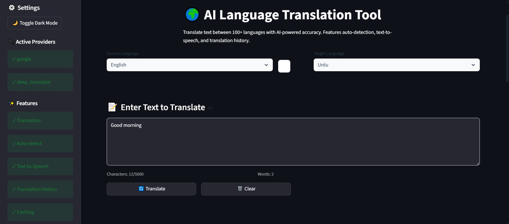
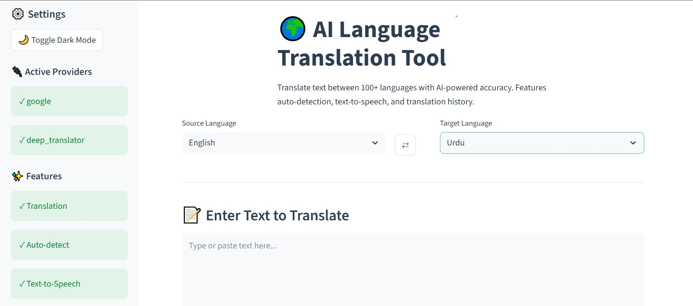
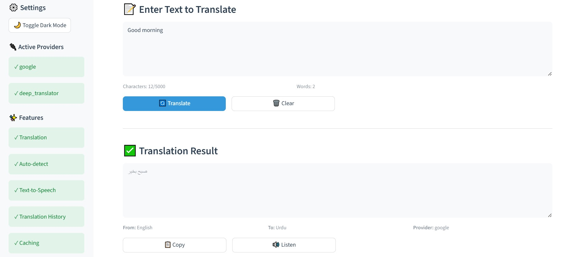
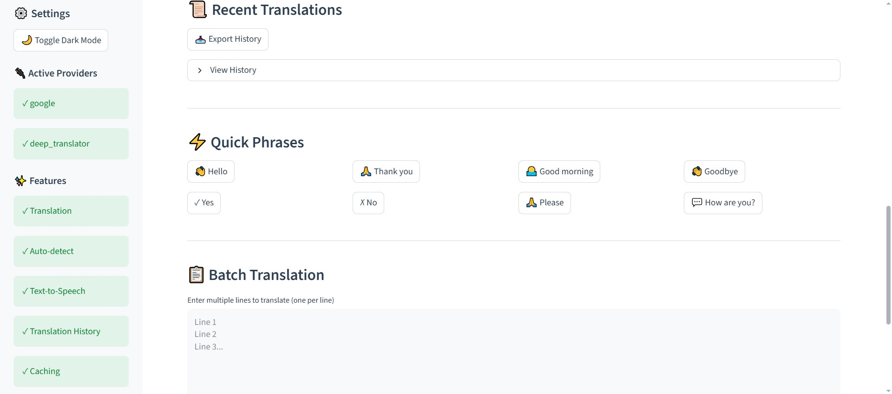

# 🌍 AI Language Translation Tool

<div align="center">



**A modern, AI-powered language translation tool with text-to-speech capabilities**

[](https://www.python.org/downloads/)
[](https://streamlit.io)
[](LICENSE)
[](https://www.codealpha.tech)

[Features](#-features) • [Demo](#-demo) • [Installation](#-installation) • [Usage](#-usage) • [Architecture](#-architecture) • [Contributing](#-contributing)

</div>

---

## 📋 Table of Contents

- [Overview](#-overview)
- [Features](#-features)
- [Demo](#-demo)
- [Architecture](#-architecture)
- [Technology Stack](#-technology-stack)
- [Installation](#-installation)
- [Usage](#-usage)
- [Project Structure](#-project-structure)
- [Configuration](#-configuration)
- [Testing](#-testing)
- [Deployment](#-deployment)
- [Troubleshooting](#-troubleshooting)
- [Contributing](#-contributing)
- [License](#-license)
- [Acknowledgments](#-acknowledgments)
- [Contact](#-contact)

---

## 🎯 Overview

The **AI Language Translation Tool** is a sophisticated web application built with Python and Streamlit that provides real-time language translation capabilities for over 100 languages. It combines modern translation APIs with text-to-speech functionality to deliver an intuitive and powerful translation experience.

### Key Highlights

- 🔤 **100+ Languages** - Support for major world languages
- 🎯 **Auto-Detection** - Automatically identify source language
- 🔊 **Text-to-Speech** - Hear translations in target language
- 💾 **Smart Caching** - Fast response times with intelligent caching
- 📜 **Translation History** - Track your recent translations
- ⚡ **Quick Phrases** - One-click common phrase translations
- 📱 **Responsive Design** - Works on desktop, tablet, and mobile
- 🌙 **Dark Mode** - Easy on the eyes

### Built For

This project was developed as part of the **CodeAlpha AI Internship Program** (Task #1: Language Translation Tool), demonstrating proficiency in:

- AI/ML integration
- Full-stack web development
- API integration and error handling
- User interface/experience design
- Production-ready code practices

---

## ✨ Features

### Core Features

| Feature | Description |
|---------|-------------|
| **Multi-Language Translation** | Translate text between 100+ languages with high accuracy |
| **Auto Language Detection** | Automatically identify the source language of your text |
| **Text-to-Speech (TTS)** | Listen to translations with natural-sounding voice synthesis |
| **Translation History** | Access your last 10 translations with timestamps |
| **Quick Phrases** | Instant translation of common phrases (Hello, Thank you, etc.) |
| **Batch Translation** | Translate multiple lines of text simultaneously |
| **Smart Caching** | LRU cache with TTL for improved performance |
| **Copy to Clipboard** | Easy copying of translated text |
| **Language Swap** | Quickly swap source and target languages |

### Technical Features

- **Multi-Provider Support** - Google Translate & Deep Translator with automatic fallback
- **Retry Logic** - Exponential backoff for failed requests
- **Input Validation** - Comprehensive text validation and sanitization
- **Error Handling** - User-friendly error messages
- **Session Management** - Maintains state across interactions
- **Export History** - Download translation history as JSON
- **Dark Mode** - Toggle between light and dark themes

---

## 📸 Demo

### Main Interface



*The clean and intuitive main interface with language selectors and translation areas*

### Translation in Action



*Real-time translation with source and target language display*

### Translation History



*View and manage your recent translations with timestamps*

### Settings & Features


*Comprehensive settings sidebar with cache statistics and feature toggles*

---

## 🏗️ Architecture

### System Architecture

```
┌─────────────────────────────────────────────────────────────┐
│                     Frontend Layer                          │
│                    (Streamlit UI)                           │
│  ┌──────────────────────────────────────────────────────┐  │
│  │  • Language Selectors                                │  │
│  │  • Input/Output Text Areas                           │  │
│  │  • Action Buttons (Translate, Copy, TTS)             │  │
│  │  • History Display                                   │  │
│  │  • Cache Statistics                                  │  │
│  └──────────────────────────────────────────────────────┘  │
└─────────────────────────┬───────────────────────────────────┘
                          │
                          ▼
┌─────────────────────────────────────────────────────────────┐
│                  Business Logic Layer                       │
│                    (Core Services)                          │
│  ┌──────────────────┐  ┌──────────────────┐               │
│  │   Translation    │  │    Language      │               │
│  │     Service      │  │    Detection     │               │
│  │  • Validation    │  │  • Auto-detect   │               │
│  │  • Caching       │  │  • Confidence    │               │
│  │  • Retry Logic   │  │    Scoring       │               │
│  └──────────────────┘  └──────────────────┘               │
│                                                             │
│  ┌──────────────────┐  ┌──────────────────┐               │
│  │   TTS Service    │  │  Cache Manager   │               │
│  │  • Audio Gen     │  │  • LRU Cache     │               │
│  │  • MP3 Output    │  │  • TTL Expiry    │               │
│  │  • Base64        │  │  • Statistics    │               │
│  └──────────────────┘  └──────────────────┘               │
└─────────────────────────┬───────────────────────────────────┘
                          │
                          ▼
┌─────────────────────────────────────────────────────────────┐
│                  Integration Layer                          │
│                 (External APIs)                             │
│  ┌──────────────────┐  ┌──────────────────┐               │
│  │   googletrans    │  │ deep-translator  │               │
│  │  (Primary API)   │  │  (Fallback API)  │               │
│  └──────────────────┘  └──────────────────┘               │
│                                                             │
│  ┌──────────────────┐  ┌──────────────────┐               │
│  │      gTTS        │  │    pyttsx3       │               │
│  │  (TTS Provider)  │  │ (Local TTS - Future) │          │
│  └──────────────────┘  └──────────────────┘               │
└─────────────────────────────────────────────────────────────┘
```

### Data Flow

```
User Input → Validation → Cache Check → API Call → Result Processing → UI Display
                             ↓              ↓
                          Cache Hit    Cache Miss
                             ↓              ↓
                      Return Cached   Fetch from API
                                           ↓
                                      Store in Cache
```

### Component Interaction

```
┌──────────────┐
│  Streamlit   │
│     App      │
└──────┬───────┘
       │
       ├──→ Translation Service
       │         ├──→ Validator
       │         ├──→ Cache Manager
       │         └──→ API Provider (googletrans/deep-translator)
       │
       ├──→ Language Detector
       │         └──→ googletrans Detector
       │
       └──→ TTS Service
                 └──→ gTTS Generator
```

---

## 🛠️ Technology Stack

### Core Technologies

| Category | Technology | Version | Purpose |
|----------|-----------|---------|---------|
| **Language** | Python | 3.10+ | Core programming language |
| **Framework** | Streamlit | 1.28+ | Web application framework |
| **Package Manager** | UV | Latest | Fast Python package management |

### Translation & Language Processing

| Library | Version | Purpose |
|---------|---------|---------|
| `googletrans` | 4.0.0rc1 | Primary translation API (unofficial Google Translate) |
| `deep-translator` | 1.11.4+ | Fallback translation provider |
| `gTTS` | 2.4.0+ | Google Text-to-Speech for audio generation |
| `pyttsx3` | 2.90+ | Offline TTS (future feature) |

### Utilities & Configuration

| Library | Version | Purpose |
|---------|---------|---------|
| `httpx` | 0.25.0+ | Modern HTTP client for API calls |
| `python-dotenv` | 1.0.0+ | Environment variable management |
| `pydantic` | 2.4.0+ | Data validation and settings management |
| `pydantic-settings` | 2.0.3+ | Settings management with Pydantic |

### Development Tools

| Tool | Purpose |
|------|---------|
| `pytest` | Unit testing framework |
| `pytest-cov` | Code coverage reporting |
| `black` | Code formatting |
| `ruff` | Fast Python linter |
| `mypy` | Static type checking |

### Architecture Pattern

- **Pattern**: Three-Tier Architecture (Presentation, Business Logic, Data/Integration)
- **Design**: Service-Oriented Architecture (SOA)
- **State Management**: Streamlit Session State
- **Caching**: LRU Cache with TTL
- **Error Handling**: Try-Catch with Retry Logic

---

## 📥 Installation

### Prerequisites

- Python 3.10 or higher
- pip or UV package manager
- Git (for cloning repository)
- Internet connection (for API access)

### Option 1: Quick Start with UV (Recommended)

```bash
# 1. Clone the repository
git clone https://github.com/yourusername/language-translation-tool.git
cd language-translation-tool

# 2. Install UV (if not already installed)
curl -LsSf https://astral.sh/uv/install.sh | sh

# 3. Create virtual environment and install dependencies
uv venv
source .venv/bin/activate  # On Windows: .venv\Scripts\activate
uv pip install -e .

# 4. Set up environment variables (optional)
cp .env.example .env
# Edit .env if you have API keys

# 5. Run the application
streamlit run src/app.py
```

### Option 2: Standard pip Installation

```bash
# 1. Clone the repository
git clone https://github.com/yourusername/language-translation-tool.git
cd language-translation-tool

# 2. Create virtual environment
python -m venv .venv
source .venv/bin/activate  # On Windows: .venv\Scripts\activate

# 3. Install dependencies
pip install -r requirements.txt

# 4. Set up environment variables (optional)
cp .env.example .env

# 5. Run the application
streamlit run src/app.py
```

### Option 3: Docker Installation

```bash
# 1. Clone the repository
git clone https://github.com/yourusername/language-translation-tool.git
cd language-translation-tool

# 2. Build Docker image
docker build -t translation-tool .

# 3. Run container
docker run -p 8501:8501 translation-tool

# 4. Open browser
# Visit: http://localhost:8501
```

### Verify Installation

```bash
# Test that all services load correctly
python test_services_interactive.py

# Expected output:
# ✓ Translation service initialized
# ✓ Language detection available
# ✓ TTS service initialized
# ✅ All services working!
```

---

## 🚀 Usage

### Basic Translation

1. **Launch the application:**
   ```bash
   streamlit run src/app.py
   ```

2. **Open your browser** to `http://localhost:8501`

3. **Select languages:**
   - Source: Choose language or use "Auto-detect"
   - Target: Choose desired translation language

4. **Enter text** in the input area

5. **Click "🔄 Translate"**

6. **View results** in the translation output area

### Advanced Features

#### Auto-Detect Language

```
1. Set source language to "Auto-detect"
2. Enter text in any language
3. Click "🔍 Detect Language" to see detected language
4. Click "🔄 Translate" to translate
```

#### Text-to-Speech

```
1. Complete a translation
2. Click "🔊 Listen" button
3. Audio player appears with pronunciation
4. Adjust volume and replay as needed
```

#### Copy Translation

```
1. Complete a translation
2. Click "📋 Copy" button
3. Code block appears with translated text
4. Click copy icon in code block or use Ctrl+C
```

#### Quick Phrases

```
1. Scroll to "⚡ Quick Phrases" section
2. Click any phrase button (e.g., "👋 Hello")
3. Phrase auto-fills in input area
4. Click translate
```

#### Batch Translation

```
1. Scroll to "📋 Batch Translation" section
2. Enter multiple lines (one per line)
3. Click "🔄 Translate All"
4. View all translations in expandable sections
```

#### View History

```
1. Scroll to "📜 Recent Translations"
2. Click "View History" expander
3. See last 10 translations with timestamps
4. Click "📥 Export History" to download JSON
5. Click "🗑️ Clear History" to reset
```

#### Dark Mode

```
1. Open sidebar (click arrow if collapsed)
2. Click "🌙 Toggle Dark Mode"
3. Interface switches to dark theme
4. Click again to return to light mode
```

---

## 📁 Project Structure

```
language-translation-tool/
├── .github/
│   └── workflows/
│       └── ci.yml                 # CI/CD pipeline
├── src/
│   ├── __init__.py
│   ├── app.py                     # Main Streamlit application
│   ├── services/
│   │   ├── __init__.py
│   │   ├── translator.py          # Translation service
│   │   ├── language_detector.py   # Language detection
│   │   └── tts_service.py         # Text-to-speech
│   ├── utils/
│   │   ├── __init__.py
│   │   ├── cache.py               # Caching logic
│   │   ├── validators.py          # Input validation
│   │   └── constants.py           # Language codes & constants
│   └── config/
│       ├── __init__.py
│       └── settings.py            # Configuration management
├── tests/
│   ├── __init__.py
│   ├── test_translator.py         # Translation tests
│   ├── test_validators.py         # Validation tests
│   ├── test_cache.py              # Cache tests
│   └── test_services.py           # Service integration tests
├── assets/
│   └── screenshots/               # Application screenshots
│       ├── banner.png
│       ├── main-interface.png
│       ├── translation-demo.png
│       ├── history-view.png
│       └── sidebar-features.png
├── docs/
│   ├── ARCHITECTURE.md            # Detailed architecture docs
│   ├── API.md                     # API documentation
│   └── CONTRIBUTING.md            # Contribution guidelines
├── .streamlit/
│   └── config.toml                # Streamlit configuration
├── .env.example                   # Environment variables template
├── .gitignore                     # Git ignore rules
├── Dockerfile                     # Docker configuration
├── pyproject.toml                 # UV project configuration
├── requirements.txt               # pip dependencies
├── LICENSE                        # MIT License
├── README.md                      # This file
└── test_services_interactive.py   # Interactive testing script
```

### Key Files Description

| File | Purpose |
|------|---------|
| `src/app.py` | Main Streamlit application with UI components |
| `src/services/translator.py` | Multi-provider translation with retry logic |
| `src/services/language_detector.py` | Automatic language detection |
| `src/services/tts_service.py` | Text-to-speech audio generation |
| `src/utils/cache.py` | LRU cache implementation with TTL |
| `src/utils/validators.py` | Input validation and sanitization |
| `src/utils/constants.py` | Language codes and application constants |
| `src/config/settings.py` | Pydantic-based configuration |
| `pyproject.toml` | Project metadata and dependencies |
| `requirements.txt` | Python package dependencies |
| `.env.example` | Example environment variables |

---

## ⚙️ Configuration

### Environment Variables

Create a `.env` file in the project root:

```bash
# Application Settings
APP_TITLE="AI Language Translation Tool"
APP_ICON="🌍"
MAX_TEXT_LENGTH=5000
DEFAULT_SOURCE_LANG=auto
DEFAULT_TARGET_LANG=es

# Cache Configuration
CACHE_ENABLED=true
CACHE_TTL_HOURS=24
CACHE_MAX_SIZE=1000

# Text-to-Speech Settings
TTS_ENABLED=true
TTS_PROVIDER=gtts
TTS_SPEED=1.0

# Development Settings
DEBUG=false
LOG_LEVEL=INFO

# Feature Flags
ENABLE_TRANSLATION_HISTORY=true
ENABLE_LANGUAGE_DETECTION=true
ENABLE_COPY_BUTTON=true
ENABLE_TTS_BUTTON=true

# API Configuration (Optional)
GOOGLE_TRANSLATE_API_KEY=your_api_key_here
AZURE_TRANSLATOR_KEY=your_azure_key_here
AZURE_TRANSLATOR_REGION=eastus
```

### Streamlit Configuration

`.streamlit/config.toml`:

```toml
[server]
port = 8501
address = "localhost"
headless = false

[browser]
gatherUsageStats = false

[theme]
primaryColor = "#3498db"
backgroundColor = "#ffffff"
secondaryBackgroundColor = "#f8f9fa"
textColor = "#2c3e50"
font = "sans serif"
```

---

## 🧪 Testing

### Run All Tests

```bash
# Run complete test suite
pytest

# Run with coverage
pytest --cov=src --cov-report=html

# Run specific test file
pytest tests/test_translator.py -v

# Run specific test class
pytest tests/test_services.py::TestTranslationService -v
```

### Interactive Testing

```bash
# Test all services interactively
python test_services_interactive.py

# Test complete workflow
python test_complete_app.py
```

### Manual Testing Checklist

- [ ] Translation works for different languages
- [ ] Auto-detect identifies languages correctly
- [ ] TTS generates and plays audio
- [ ] Copy button works (shows code block)
- [ ] Swap languages button swaps correctly
- [ ] History tracks translations
- [ ] Cache improves performance
- [ ] Dark mode toggles properly
- [ ] Quick phrases auto-fill input
- [ ] Batch translation processes multiple lines
- [ ] Export history downloads JSON

---

## 🐛 Troubleshooting

### Common Issues

#### Issue: "googletrans" not working

**Solution:**
```bash
# Reinstall googletrans
pip uninstall googletrans
pip install googletrans==4.0.0rc1
```

#### Issue: TTS audio not playing

**Solution:**
- Check browser audio permissions
- Ensure gTTS is installed: `pip install gTTS`
- Try different browser (Chrome recommended)

#### Issue: Dark mode not applying

**Solution:**
- Clear browser cache (Ctrl+Shift+R)
- Restart Streamlit app
- Check if toggle is in sidebar

#### Issue: Copy button not working

**Solution:**
- Install pyperclip: `pip install pyperclip`
- Or use native code block copy icon
- On Linux: Install xclip or xsel

#### Issue: Cache not working

**Solution:**
- Check `.env`: `CACHE_ENABLED=true`
- Clear cache from sidebar
- Restart application

### Debug Mode

Enable debug logging:

```python
# In .env
DEBUG=true
LOG_LEVEL=DEBUG
```

View logs:
```bash
streamlit run src/app.py --logger.level=debug
```

---

## 🤝 Contributing

We welcome contributions! Here's how to get started:

### Development Setup

```bash
# 1. Fork the repository on GitHub

# 2. Clone your fork
git clone https://github.com/YOUR-USERNAME/language-translation-tool.git
cd language-translation-tool

# 3. Create a branch
git checkout -b feature/your-feature-name

# 4. Install dev dependencies
uv pip install -e ".[dev,test]"

# 5. Make your changes

# 6. Run tests
pytest

# 7. Format code
black src/
ruff check src/

# 8. Commit and push
git add .
git commit -m "Add: your feature description"
git push origin feature/your-feature-name

# 9. Create Pull Request on GitHub
```

### Contribution Guidelines

- Follow PEP 8 style guide
- Add tests for new features
- Update documentation
- Write clear commit messages
- Keep PRs focused and small

### Areas for Contribution

- 🌐 Add more translation providers
- 🎨 Improve UI/UX design
- 🧪 Increase test coverage
- 📚 Enhance documentation
- 🐛 Fix bugs
- ⚡ Performance optimization
- 🌍 Add more languages

---

## 📄 License

This project is licensed under the MIT License - see the [LICENSE](LICENSE) file for details.

```
MIT License

Copyright (c) 2025 [pforprogrammer]

Permission is hereby granted, free of charge, to any person obtaining a copy
of this software and associated documentation files (the "Software"), to deal
in the Software without restriction, including without limitation the rights
to use, copy, modify, merge, publish, distribute, sublicense, and/or sell
copies of the Software, and to permit persons to whom the Software is
furnished to do so, subject to the following conditions:

The above copyright notice and this permission notice shall be included in all
copies or substantial portions of the Software.

THE SOFTWARE IS PROVIDED "AS IS", WITHOUT WARRANTY OF ANY KIND, EXPRESS OR
IMPLIED, INCLUDING BUT NOT LIMITED TO THE WARRANTIES OF MERCHANTABILITY,
FITNESS FOR A PARTICULAR PURPOSE AND NONINFRINGEMENT. IN NO EVENT SHALL THE
AUTHORS OR COPYRIGHT HOLDERS BE LIABLE FOR ANY CLAIM, DAMAGES OR OTHER
LIABILITY, WHETHER IN AN ACTION OF CONTRACT, TORT OR OTHERWISE, ARISING FROM,
OUT OF OR IN CONNECTION WITH THE SOFTWARE OR THE USE OR OTHER DEALINGS IN THE
SOFTWARE.
```

---

## 🙏 Acknowledgments

### Special Thanks

- **CodeAlpha** - For the internship opportunity and project guidance
- **Streamlit Team** - For the amazing web framework
- **Google Translate** - For translation API access
- **Open Source Community** - For the libraries and tools

### Libraries & Resources

- [Streamlit](https://streamlit.io) - Web application framework
- [googletrans](https://github.com/ssut/py-googletrans) - Translation API
- [deep-translator](https://github.com/nidhaloff/deep-translator) - Multi-provider translation
- [gTTS](https://github.com/pndurette/gTTS) - Text-to-speech
- [Pydantic](https://pydantic-docs.helpmanual.io/) - Data validation
- [UV](https://github.com/astral-sh/uv) - Fast Python package manager

### Inspiration

This project was inspired by the need for a simple, fast, and reliable translation tool that combines modern AI capabilities with an intuitive user interface.

---

## 📧 Contact

### Project Maintainer

**[Hassan Ahmed]**
- GitHub: [@pforprogrammer](https://github.com/pforprogrammer)
- LinkedIn: [Hassan Ahmed](https://linkedin.com/in/pforprogrammer)
- Email: agentic.hassan.ai@gmail.com

### CodeAlpha Internship

- **Website**: [www.codealpha.tech](https://www.codealpha.tech)
- **WhatsApp**: +91 8052293611
- **Email**: services@codealpha.tech

---
### Roadmap

- [x] Core translation functionality
- [x] Auto language detection
- [x] Text-to-speech
- [x] Translation history
- [x] Dark mode
- [x] Batch translation
- [ ] Offline mode with local models
- [ ] PDF/Document translation
- [ ] Browser extension
- [ ] Mobile app (React Native)
- [ ] API endpoint for developers
- [ ] Multi-user support with accounts

---

<div align="center">

**Made with ❤️ by pforprogrammer aka Hassan Ahmed for the CodeAlpha AI Internship Program**

[⬆ Back to Top](#-ai-language-translation-tool)

</div>
